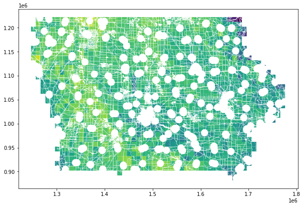

```{r setup, include=FALSE}
knitr::opts_chunk$set(echo = FALSE)
```

***Note****: This analysis was originally a Jupyter notebook which I ported over to an Rmd. You can view it in its original format here:* [iowa-wind-energy.ipynb](files/iowa_wind_jupyter.html)  

### Libraries

```python
import sqlalchemy
import psycopg2
import geopandas as gpd
import matplotlib.pyplot as plt
import math
```

### Objective

The state of Iowa is both sparsely populated and has a landscape and wind speeds conducive to wind energy capture. The following analysis assesses the full potential that Iowa has to produce clean energy from wind turbines. This will give imortant insight to inform future wind energy development.

### Methods

The specifications of the Vestas V136-3.45 MW wind turbines will be used for the analysis. In order to identify viable space for wind turbines, we query a PostGIS database containing Iowa feature data extracted from OpenStreetMap. Suitable area is determined twice based on two different scenarios invoving spacing around residences. The first scenario (referred to here on as "scenario 1") requires that turbines be three times their hub height away from residential buildings, and the second scenario ("scenario 2") requires ten times the hub height. We query all areas unsuitable for turbines, compiling their geometries into a geodataframe, and subtract them from a grid representing Iowa that contains windspeed data. We then determine the possible number of wind turbines that could be placed in each cell of the grid, and use those values in conjunction with windspeeds to determine the amount of energy each cell could generate annually. Energy outputs are summed and we arrive at two figures representing total annual energy output for the two differnt scenarios.

### Connecting to database

We first establish our connection to the PostGIS database using the `sqalchemy` and `psycopg2` libraries.


```python
pg_uri_template = 'postgresql+psycopg2://{user}:{pwd}@{host}/{db_name}'
```


```python
uri = pg_uri_template.format(
    host='128.111.89.111',
    user='eds223_students',
    pwd='eds223',
    db_name='osmiowa'
)
```


```python
db = sqlalchemy.create_engine(uri)
connection = db.connect()
```

### Subqueries

Next, we define each of our subqueries for the tables of interest in the database with the goal of compiling all areas that are *not* suitable for wind turbines. We use `ST_BUFFER` to incorporate the areas around certain features based on legal spatial constraints of turbine placement. Many these constraints are functions of the dimensions of the particular wind turbine model—those variables are defined for the model used in this analysis. We use two different residential queries that use different buffer sizes based on the two scenarios previously mentioned.

Hub height and rotor diameter of the Vestas V136-3.45 MW are stored as variables


```python
hub_height = 150 # meters
rotor_diameter = 136 # meters
```

Here we create our two residential subqueries that attempt to encompass all residential buildings defined in the database.


```python
residential_query_3h = f"""
SELECT ST_BUFFER(way, 3 * {hub_height}) 
FROM planet_osm_polygon
WHERE building IN ('yes', 'residential', 'apartments', 'house', 'static_caravan', 'detached')
OR landuse = 'residential'
OR place = 'town'
"""
```


```python
residential_query_10h = f"""
SELECT ST_BUFFER(way, 10 * {hub_height}) 
FROM planet_osm_polygon
WHERE building IN ('yes', 'residential', 'apartments', 'house', 'static_caravan', 'detached')
OR landuse = 'residential'
OR place = 'town'
"""
```

Nonresidential buildings require 3 * `hub_height` regardless of scenario.


```python
nonres_query = f"""
SELECT ST_BUFFER(way, (3 * {hub_height})) 
FROM planet_osm_polygon
WHERE building IS NOT NULL
AND building NOT IN ('yes', 'residential', 'apartments', 'house', 'static_caravan', 'detached')
"""
```

Below we create subqueries for airports, military areas, railroads, highways, nature reserves, parks, wetlands, water bodies, powerlines, powerplants, and exisitng wind turbines—along with their corresponding buffers.


```python
airport_query = """
SELECT ST_BUFFER(way, 7500)
FROM planet_osm_polygon
WHERE aeroway IS NOT NULL
"""
```


```python
military_query = """
SELECT ST_BUFFER(way, 0)
FROM planet_osm_polygon
WHERE (landuse = military) OR (military IS NOT NULL)
"""
```


```python
rail_hwy_query = f"""
SELECT ST_BUFFER(way, (2 * {hub_height}))
FROM planet_osm_line
WHERE railway = 'rail'
OR highway IN ('trunk', 'motorway', 'primary', 'secondary')
OR highway LIKE '%%link'
"""
```


```python
reserves_parks_wetlands_query = """
SELECT ST_BUFFER(way, 0)
FROM planet_osm_polygon
WHERE "natural" IS NOT null
AND leisure IS NOT null
"""
```


```python
rivers_query = f"""
SELECT ST_BUFFER(way, {hub_height})
FROM planet_osm_line
WHERE waterway = 'river'
"""
```


```python
lake_query = """
SELECT ST_BUFFER(way, 0)
FROM planet_osm_polygon
WHERE water IN ('lake', 'pond', 'reservoir')
"""
```


```python
powerline_query = f"""
SELECT ST_BUFFER(way, (2 * {hub_height}))
FROM planet_osm_line
WHERE power IS NOT NULL
"""
```


```python
powerplant_query = f"""
SELECT ST_BUFFER(way, {hub_height})
FROM planet_osm_polygon
WHERE power IS NOT NULL
"""
```


```python
wind_query = f"""
SELECT ST_BUFFER(way, (5 * {rotor_diameter}))
FROM planet_osm_point
WHERE "generator:source" = 'wind'
"""
```

### Aggregated queries

Here we create two aggregate queries by unioning our subqueries—one for scenario 1, and one for scenario 2.


```python
full_query_3h = f"""
{residential_query_3h}
UNION
{nonres_query}
UNION
{airport_query}
UNION
{military_query}
UNION
{rail_hwy_query}
UNION
{reserves_parks_wetlands_query}
UNION
{rivers_query}
UNION
{lake_query}
UNION
{powerline_query}
UNION
{powerplant_query}
UNION
{wind_query}
"""
```


```python
full_query_10h = f"""
{residential_query_10h}
UNION
{nonres_query}
UNION
{airport_query}
UNION
{military_query}
UNION
{rail_hwy_query}
UNION
{reserves_parks_wetlands_query}
UNION
{rivers_query}
UNION
{lake_query}
UNION
{powerline_query}
UNION
{powerplant_query}
UNION
{wind_query}
"""
```

Next we query the database for both scenarios.


```python
siting_constraints_3h = gpd.read_postgis(full_query_3h, con = connection, geom_col = 'st_buffer')
```


```python
siting_constraints_10h = gpd.read_postgis(full_query_10h, con = connection, geom_col = 'st_buffer')
```

### Wind speeds grid

Here we query all columns from a table containing Iowa grid cells and average windspeeds for the regions they represent.


```python
wind_cells_query = """
SELECT * FROM wind_cells_10000
"""
```


```python
wind_cells = gpd.read_postgis(wind_cells_query, con = connection, geom_col = 'geom')
```

Next we subtract the unsuitable areas from the grid for both scenarios


```python
suitable_cells_3h = wind_cells.overlay(siting_constraints_3h, how='difference')
```


```python
suitable_cells_10h = wind_cells.overlay(siting_constraints_10h, how='difference')
```

Taking a look at our suitable areas in scenario 1, with cells colored by wind speed:


```python
fig, ax = plt.subplots(figsize=(10, 10))
ax = suitable_cells_3h.plot(column='wind_speed', ax = ax)
```


    

    


Wind turbines need to be placed 5 rotor diameters apart. Below we calculate the necessary buffer area around each turbine—the buffer will have a radius of 2.5 * `rotor_diameter` so that adjoining buffers create a 5 * `rotor_diameter` distance between turbines. We then divide the suitable area of each cell by the buffer area to determine how many turbines can exist in them.


```python
turbine_buffer_radius = 2.5 * rotor_diameter
turbine_buffer = math.pi * (turbine_buffer_radius ** 2)
```


```python
suitable_cells_3h['possible_turbines'] = suitable_cells_3h.area / turbine_buffer
```


```python
suitable_cells_10h['possible_turbines'] = suitable_cells_10h.area / turbine_buffer
```

Next we use the equation $E = 2.6 s m-1 v + -5 GWh$ to calcuate energy production per cell.

$E$ = energy production per turbine in GWh

$v$ = average annual wind speed in $m/s^-1$

And then multiply the energy production per turbine by the number of possible turbines.


```python
suitable_cells_3h['annual_energy_gwh'] = \
  ((2.6 * suitable_cells_3h['wind_speed']) - 5) * suitable_cells_3h['possible_turbines']
```


```python
suitable_cells_10h['annual_energy_gwh'] = \
  ((2.6 * suitable_cells_10h['wind_speed']) - 5) * suitable_cells_10h['possible_turbines']
```

The energy production of all cells is summed and the final results we arrived at are printed below:


```python
total_annual_energy_3h = suitable_cells_3h['annual_energy_gwh'].sum().round(5)

print(f"""Total possible annual wind energy production
      in Iowa given scenario 1: {total_annual_energy_3h} GWh/yr""")
```

    Total possible annual wind energy production in Iowa given scenario 1: 4322397.04441 GWh/yr


```python
total_annual_energy_10h = suitable_cells_10h['annual_energy_gwh'].sum().round(5)

print(f"""Total possible annual wind energy production 
      in Iowa given scenario 2: {total_annual_energy_10h} GWh/yr""")
```

    Total possible annual wind energy production in Iowa given scenario 2: 3922073.53289 GWh/yr


### Conclusions

According to Energy.gov and the EIA, Iowa's annual energy use is 45.7 TWh, and the total for the US is 27,238.9 TWh


```python
# Determining how our scenario 2 values compare with Iowa's and the US's expenditures
total_annual_energy_twh = total_annual_energy_10h / 1000
iowa_factor = total_annual_energy_twh / 45.7
print(iowa_factor)

us_factor = total_annual_energy_twh / 27238.9
print(us_factor)
```

    85.82217796258205
    0.14398795593397676


Based on even the more conservative scenario in this analysis, using all viable space in Iowa for wind turbines would generate roughly **85.8** times the annual energy expenditure of the state, and about **14.4%** of the annual energy expenditure of the entire country.

These figures convey the incredible potential for wind energy capture in Iowa and other similar regions.


