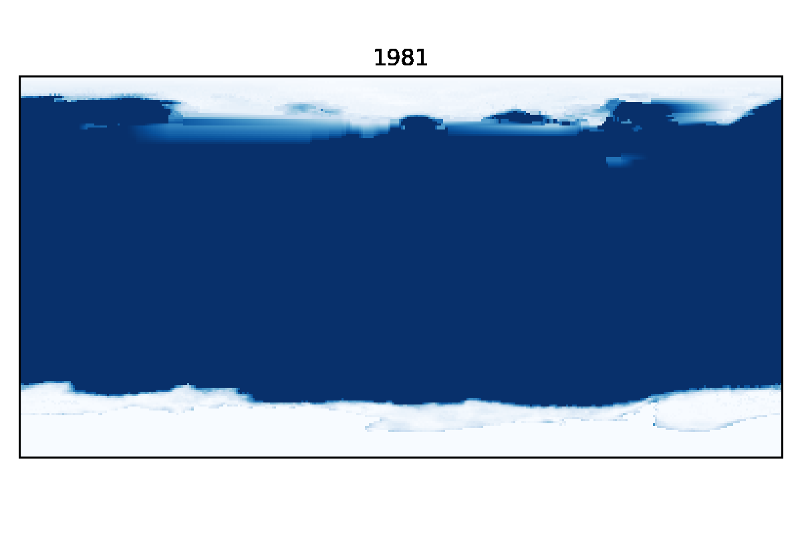

```{r setup, include=FALSE}
knitr::opts_chunk$set(echo = FALSE)
```

### Purpose

The goal here is to rasterize the contents of a netCDF file containing global sea ice concentrations in October from 1981 to 2020, and then compile each of those rasters into a single gif. 

### Libraries

```python
import xarray as xr
import rasterio as rio
import pandas as pd 
from rasterio.plot import show
import matplotlib.pyplot as plt
import rioxarray
import imageio
```
### Dataset

These data are a small subset I created of the [Merged Hadley-OI sea surface temperature and sea ice concentration dataset](https://dashrepo.ucar.edu/dataset/158_asphilli.html). We'll read them in as an `xarray` dataset.

```python
ice = xr.open_dataset("data/noaa_ice_81-20.nc")
```
Becuase we're working with spatial data, we need to set the coordinate reference system (CRS) and specify our spatial dimensions—in this case: `lon` and `lat`. 

```python
ice = ice.rio.write_crs(4326, inplace=True)

ice = ice['SEAICE'].rio.set_spatial_dims('lon', 'lat')

ice = ice.rename({'lat':'latitude', 'lon':'longitude'})
```

### Creating the rasters

Here we create a loop that exports the sea ice data from each year as a tiff using `rasterio.to_raster()`, renders it (quietly) with `pyplot.imshow()`, and then saves the formatted image as a png with `pyplot.savefig()`. An important part of the formatting portion of the loop is titling each image with its corresponding year: `plt.title(years[i])`.

```python
years = range(1981, 2021)

rasters = []
```

```python
for i in range(0, len(ice)):

    ice_i = ice[i]

    tiff = 'Data/noaa_ice_' + str(years[i]) + '.tif'

    ice_i.rio.to_raster(tiff)
    
    # opening the tiff we just exported
    open_rast = rio.open(tiff)
    
    # reading the first (and only) band within the raster
    read_rast = open_rast.read(1)

    # preventing matplotlib from displaying every image 
    plt.ioff()

    plt.figure(frameon=False)
    plt.imshow(read_rast,
                origin='lower',
                cmap='Blues_r',
                extent=[-180, 180, -90, 90])
    plt.title(years[i])
    plt.tick_params(left=False, bottom=False)
    plt.xticks([])
    plt.yticks([])
    plt.tight_layout()

    png = tiff + ".png"
    
    # save the figure we just created with a resolution of 200 dpi
    plt.savefig(png, dpi=200)
    plt.close()
    
    # compiling a list of the file names for the next step
    rasters.append(png)
```

### Creating the gif

Lastly we'll use the `imageio` library to create the final animation. To do this, we iterate through the list of png files we created in the last loop, reading each of them in using `imageio.imread()` and compiling them into a new list. We then feed that list into `imageio.mimsave()` which aggregates and exports the images as a gif. The default frame rate is quite fast, so we can reduce the `duration` to 0.5 seconds to make the animation a bit more digestible. 

```python
png_imageio = []

for file in rasters:
    png_imageio.append(imageio.imread(file))

imageio.mimsave('Data/ice_81_20.gif', png_imageio, **{'duration':0.5})
```
### The final product


